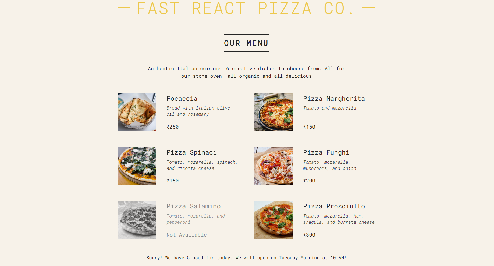

# Pizza Menu React App

This is my very first React App.

## Features

- It contains basic functionalities like components, props, state and fragments.
- It demostrates how we can share properties between components.
- In this I have used a Pizza data and tried to demonstrate that data beautifully using react library.

## How to run the project

- Download or clone the repository
- Do a `npm install` to install necessary packages
- Then run `npm run start`
- Then the project should locally at port 3000.

## After Running it should look like below image

The `order` button has currently no functionality. It is just for attraction and is dummy in the project 😅

